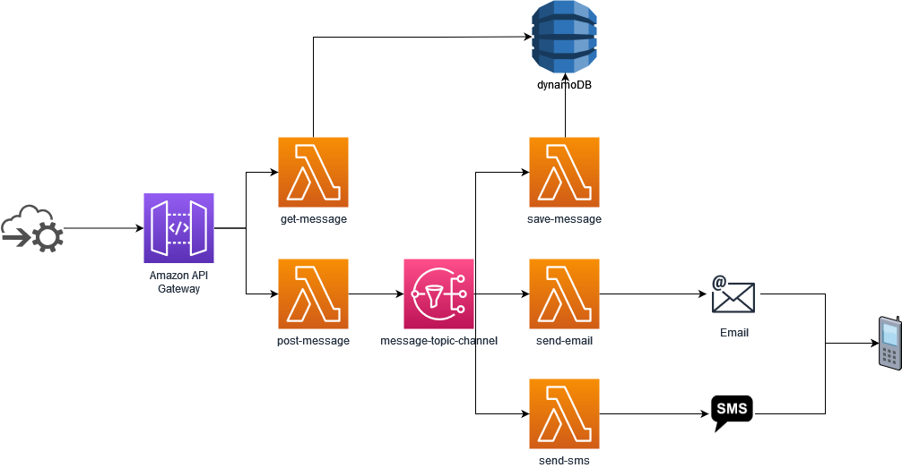

<!--
title: 'AWS NodeJS Example'
description: 'This template demonstrates how to deploy a NodeJS function running on AWS Lambda using the traditional Serverless Framework.'
layout: Doc
framework: v2
platform: AWS
language: nodeJS
priority: 1
authorLink: 'https://github.com/serverless'
authorName: 'Serverless, inc.'
authorAvatar: 'https://avatars1.githubusercontent.com/u/13742415?s=200&v=4'
-->


# Summary

This project consists on solving TM PRO challenge with serverless framework with NodeJS. 
The approach consisted on by problem solving approach, adding a bit of unknown and new things learning by doing.

First the idea was to sketch the requirements on piece of paper. After having a mind map, translate it to AWS offerings and see how can it be shaped or modified. It went initialy from a microservice to completly broken apart lambda architecture.

On top of that, the biggest added value of this challenge is using this team to learn new  unknown things. So i took this time to add something new to my toolbelt. I decided to use a different approach by using something completly unknown to me [Serverless Framework](https://www.serverless.com/).

With this framework, one can develop serverless applications with code as infrastructure defined in **serverless.yml**, and support multiple cloud providers.

# Architecture



## Usage of application

### Requirements
* AWS CLI installed and configured with your personal credentials
* Serverless framework installed.
### Deployment

In order to deploy the current architecture, you need to run the following command:

```
$ serverless deploy
```

After running deploy, you should see output similar to:

```bash
Serverless: Using provider credentials, configured via dashboard: https://app.serverless.com/raulcorreia7/apps/tmpro-challenge/raul-project/dev/eu-central-1/providers
Serverless: Packaging service...
Serverless: Excluding development dependencies...
Serverless: Creating Stack...
Serverless: Checking Stack create progress...
........
Serverless: Stack create finished...
Serverless: Uploading CloudFormation file to S3...
Serverless: Uploading artifacts...
Serverless: Uploading service raul-project.zip file to S3 (334.14 kB)...
Serverless: Validating template...
Serverless: Updating Stack...
Serverless: Checking Stack update progress...
...........................................................................................................................
Serverless: Stack update finished...
Service Information
service: raul-project
stage: dev
region: eu-central-1
stack: raul-project-dev
resources: 42
api keys:
  None
endpoints:
  POST - https://2wpaiwjua7.execute-api.eu-central-1.amazonaws.com/message
  GET - https://2wpaiwjua7.execute-api.eu-central-1.amazonaws.com/message/{target}
functions:
  post-message: raul-project-dev-post-message
  get-message: raul-project-dev-get-message
  save-message: raul-project-dev-save-message
  send-email: raul-project-dev-send-email
  send-sms: raul-project-dev-send-sms
layers:
  None
Serverless: Publishing service to the Serverless Dashboard...
Serverless: Successfully published your service to the Serverless Dashboard: https://app.serverless.com/raulcorreia7/apps/tmpro-challenge/raul-project/dev/eu-central-1
```

### Invocation

After successful deployment, you can invoke the deployed function by using the following command:

```bash
serverless invoke --function get-message '{“pathParameters”:{“target”:“+examplephonenumber”}}'
serverless invoke --function post-message --data { \"message\" : \"hello world\", \"delivery\" : \"sms\", \"target\" : \"+examplephonenumber\" }

serverless invoke --function save-message
serverless invoke --function send-email
serverless invoke --function send-sms
```

Which should result in response similar to the following:

```json
{
    "statusCode": 200,
    "body": "Message was published with success."
}
```

### Example injection

In the folder scripts there are two files :
* post-examples - tool to post a set of examples with emails and sms. (warning: non valid phone numbers.)
* post - tool to post with named parameters a message


#### Usage
* post-examples my_url
```bash
frost@DESKTOP-OCH5C7V:~/tmpro-challenge/scripts$ ./post-examples.sh "{REPLACE_THIS_URL_WITH_URL_FROM_DEPLOY}"
Message was published with success.
Message was published with success.
Message was published with success.
Message was published with success.
```
* post --url a --message b --delivery c --target d
```bash
frost@DESKTOP-OCH5C7V:~/tmpro-challenge/scripts$ ./post.sh --url "{REPLACE_THIS_URL_WITH_URL_FROM_DEPLOY}" --message "hello world" --delivery "sms" --target "+31xxxxxxxxxx"
URL           = "{REPLACE_THIS_URL_WITH_URL_FROM_DEPLOY}"
MESSAGE       = hello world
DELIVERY      = sms
TARGET        = +31xxxxxxxxxx
JSON : { "message" : "hello world", "delivery" : "sms", "target" : "+31xxxxxxxxxx" }
```
